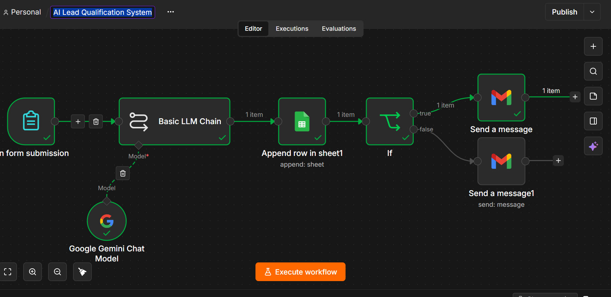
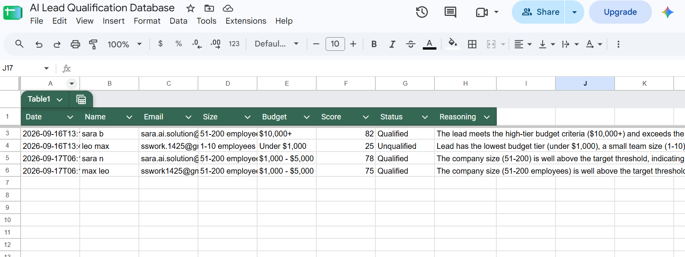
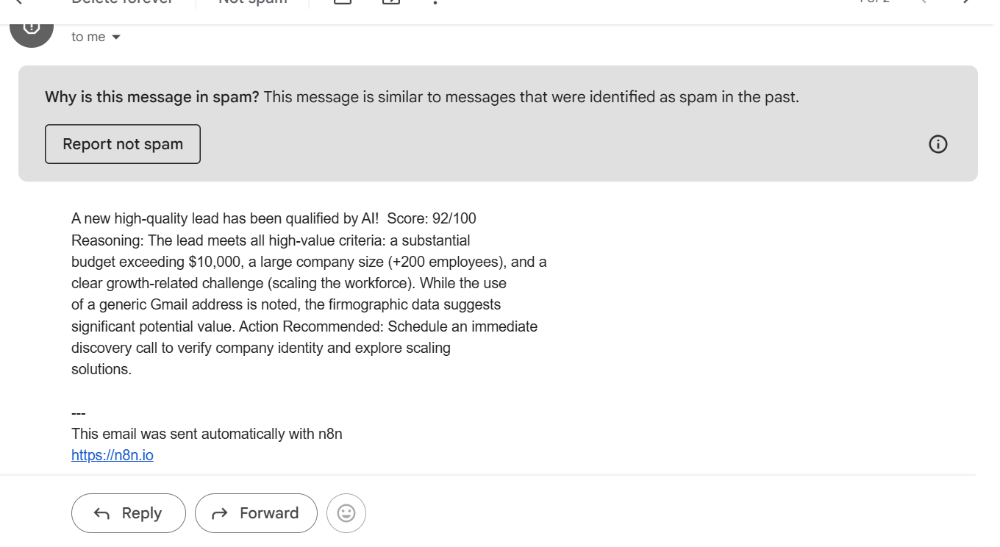

# 📥 AI Lead Qualification & Automated Routing System

An automated AI-driven lead scoring and qualification system built with **n8n**, **Google Gemini AI**, **Google Sheets API**, and **Gmail API**. It captures incoming sales leads, evaluates their qualification status using generative AI, logs structured data, and routes tailored response emails based on lead priority.

---

## 📽️ System Live Demo
📺 **[Click Here to Watch the Live Demo Video](https://www.loom.com/share/1546c5ac7fcb422f988ed8e1fba2d669)**

---

## 📸 System Screenshots & Visual Proof

| n8n Workflow Canvas | Google Sheets Database | Gmail Response |
| :---: | :---: | :---: |
|  |  |  |

---

## 🔑 Key Features
* **Real-Time Webform Trigger**: Captures submissions instantaneously without manual intervention.
* **AI-Powered Lead Scoring**: Leverages Google Gemini AI to analyze budget, company size, and challenge context to generate a dynamic score (0-100).
* **Structured Data Logging**: Appends incoming lead details, dynamic AI scores, and qualification reasoning into a Google Sheets document.
* **Smart Conditional Branching**: Evaluates score thresholds ($\ge 70$) using an `If` routing node.
* **Automated Email Outreach**: Sends personalized outreach emails to qualified leads and polite follow-up messages to low-priority prospects via Gmail API.

---

## 🛠️ Tech Stack
* **Workflow Engine**: n8n
* **AI Engine**: Google Gemini (Basic LLM Chain)
* **Database / CRM**: Google Sheets API
* **Email Engine**: Gmail API (OAuth 2.0)

---

## 🚀 How to Import and Run

1. Download the JSON workflow file: [`AI Lead Qualification System.json`](./AI%20Lead%20Qualification%20System.json).
2. Open your n8n canvas and click **Import from File**.
3. Upload `AI Lead Qualification System.json`.
4. Configure your **Google Gemini AI**, **Google Sheets**, and **Gmail** OAuth2 credentials.
5. Activate the workflow and test with a sample form submission!
